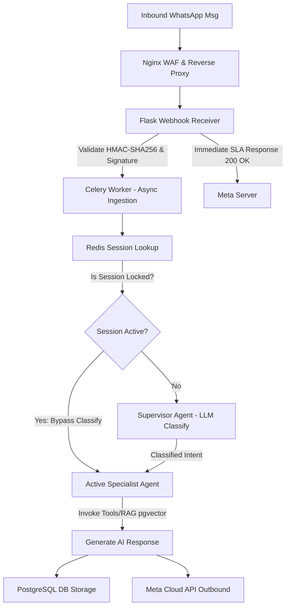

# 🤖 Enterprise AI WhatsApp Automation Platform: Technical Overview & Architectural Advantage

---

## 🌟 Executive Summary
The AI WhatsApp Automation Platform is a multi-tenant, enterprise-ready SaaS solution designed to automate high-throughput business communication on WhatsApp. Unlike traditional visual flow-builders or simple single-LLM wrappers, this platform introduces a **Supervisor-Specialist multi-agent system**, a **hybrid declarative/agentic workflow engine**, **robust asynchronous processing pipelines**, and **industry-leading security models (transparent AES-256-GCM encryption at the database layer)**.

---

## 🧠 Architectural Advantage: Why This Platform Wins
Many current WhatsApp automation tools are bottlenecked by either simplistic flowcharts or slow, expensive, and insecure LLM APIs. Below is a breakdown of how this platform overcomes these limitations.

### 1. Multi-Agent Specialist Orchestration vs. Monolithic LLMs
* **The Problem**: A single, general-purpose LLM prompt managing sales, bookings, support, and context retrieval is slow, expensive (due to high token volumes), prone to hallucinations, and highly vulnerable to prompt injection attacks.
* **Our Solution**: An [AgentRouter](file:///Users/dakshabordekar/Whatsapp-Bot/backend/app/ai/orchestrator/router.py) acts as a Supervisor to inspect incoming requests and route them to dedicated, single-purpose agents:
    * `LeadAgent`: Qualifies leads, scores interest, and triggers CRM integrations.
    * `SupportAgent`: Answers FAQs, references documentation, and creates support tickets.
    * `SalesAgent`: Handles product inquiries, browses catalogs, and guides users through purchase funnels.
    * `AppointmentAgent`: Connects to scheduling APIs (e.g., Google Calendar) to book slots.
    * `KnowledgeAgent`: Powered by a local `pgvector` RAG pipeline for advanced document retrieval.
    * `HRAgent` & `ProjectAgent`: Internal organization tasks.
* **Sticky Session Locking**: The router caches agent selections in Redis for 30 minutes. Once a customer starts a Support session, subsequent messages route directly to the `SupportAgent` without calling the Supervisor agent for classification. This saves LLM token costs and reduces latency by ~500ms.

### 2. High-Throughput Async Webhook Ingestion vs. Inline LLM Calls
* **The Problem**: Meta requires all webhook events to be acknowledged with a `200 OK` within 5 seconds. Failing to do so triggers retries, webhook disabling, and rate limits. Because LLMs take 1.5s - 4s to respond, inline processing cannot meet this SLA under load.
* **Our Solution**: The Flask endpoint immediately validates the incoming Meta HMAC-SHA256 signature, parses the payload, enqueues it to a Celery background queue (`process_inbound_webhook_task`), and returns `200 OK` within milliseconds. This design guarantees resilience under massive concurrent incoming messaging volumes.

### 3. High-Performance Local RAG with `pgvector` & LLM-as-Judge Reranking
* **The Problem**: Standard vector database searches (like Pinecone or Milvus) introduce extra network hops, lack transactional integrity with the main application database, and retrieve chunks based purely on embedding-space cosine similarity, resulting in high false positives.
* **Our Solution**: We store embeddings directly in PostgreSQL using `pgvector` for instant queries and atomic transactions. After retrieving the top-K candidates, a [Reranker](file:///Users/dakshabordekar/Whatsapp-Bot/backend/app/ai/rag/reranker.py) runs concurrently to grade candidates (0–10 scale) on relevance. This eliminates irrelevant search fragments and guarantees high-precision agent answers.

### 4. Enterprise-Grade Transparent DB Encryption vs. Plaintext Credentials
* **The Problem**: Many platforms store clients' WhatsApp access tokens and keys in plaintext in PostgreSQL or encrypt them globally. A simple database dump compromises the entire platform's customer integrations.
* **Our Solution**: We utilize an `EncryptedText` SQLAlchemy TypeDecorator mapped to columns at database load/save. Column values (e.g., Meta `access_token`) are symmetrically encrypted with AES-256-GCM using standard cryptographically secure nonces. Keys are isolated, and rotation is built-in (`make rotate-keys`), ensuring at-rest compliance.

### 5. Seamless Human Handoff with Auto-Bypass Routing
* **The Problem**: When a bot gets stuck, it needs to escalate to a human. If the bot is still active, it might interrupt the human agent's chat, causing confusion.
* **Our Solution**: The system features a Handoff Manager. Conversations set to `HUMAN_HANDLING` or `ESCALATED` completely bypass AI classification and agent routing in `AgentRouter`. The bot becomes silent, allowing the human agent to interact seamlessly via the React Dashboard.

---

## 📊 Feature-by-Feature Competitive Landscape

| Feature / Dimension | Traditional Chatbot Builders (e.g., ManyChat, Wati) | Monolithic LLM Integrations (Simple Wrappers) | **Our AI WhatsApp Platform** |
| :--- | :--- | :--- | :--- |
| **Conversational Flexibility** | ❌ Rigid flowcharts. User must type exact buttons/keywords or the bot breaks. | 🟡 High flexibility but easily gets off-topic or confused. | 🟢 **Specialist multi-agent system** keeps bot focused on current business goals. |
| **Response Latency & Meta SLA**| 🟢 Fast (hardcoded rules) | ❌ High failure rate. Inline LLM calls cause webhook timeouts. | 🟢 **Immediate response (<50ms)** via Celery queues; back-end agent completes tasks async. |
| **Security at Rest** | 🟡 Standard database encryption, vendor lock-in. | ❌ Plaintext configuration variables. | 🟢 **Transparent AES-256-GCM** database column encryption. |
| **Workflow Automation** | 🟢 Native visual flow integration. | ❌ None. Can only generate chat text. | 🟢 **Hybrid model**: LLM agents call visual workflow executors (send message, tickets, etc.). |
| **Knowledge Retrieval (RAG)** | ❌ Hardcoded FAQs only. | 🟡 Third-party external API vector stores (costly, slow). | 🟢 **Local pgvector + LLM-as-Judge Reranker** for exact knowledge matching. |
| **Vendor Independence** | ❌ None. Locked into Wati/ManyChat. | ❌ Locked into OpenAI/Gemini APIs. | 🟢 **Hot-swappable providers** (Gemini to local/offline Ollama). |

---

## 🛠️ Deep Dive: Core Modules

### 1. The Multi-Agent Registry & BaseAgent Interface
Specialist agents inherit from the abstract `BaseAgent` class:
* **OpenAI Function-Calling Format**: Tools are registered declaratively using JSON schemas.
* **Dynamic Response Generator**: Manages system prompts, turns history retrieval via `ContextManager` (stored in Redis), tool execution loop, and PostgreSQL outbound message persistence.

### 2. The Hybrid Visual Workflow Engine
Located in `app/workflows/`, this engine handles structured workflows.
* **Workflow State Machine**: Transitions workflows between states (`PENDING`, `RUNNING`, `COMPLETED`, `FAILED`).
* **Declarative Steps**: Supports steps like:
    1. `send_message`: Sends templates or dynamically computed strings via the WhatsApp Cloud API.
    2. `create_ticket`: Escalates technical problems by calling the database CRM.
    3. `update_context`: Updates organizational context and user flags.
    4. `wait`: Pauses execution until a callback occurs.

---

## 🔒 Comprehensive Threat Model & Security Posture
The platform adopts a Zero-Trust approach for multi-tenant isolation:
1. **Organization Isolation**: All PostgreSQL query builders filter tables by `organization_id` (enforced via application query wrappers).
2. **Verify & Access Tokens**: Meta Cloud API verifying handshakes require high-entropy signature verification (`X-Hub-Signature-256`).
3. **WAF & Rate Limiting**: Production deployment runs under Nginx configured with ModSecurity Web Application Firewall, TLS termination, and strict route-based rate-limits.
